 CommunityServiceAppPublic 
Public version of Community Service App (Triber) with sensitive keys removed as follows:
- Google Maps Api Key
- Firebase Key
- Google AdMob

This is a showcase of the code implementation for the project. #Work in Progress


You can download the app at &nbsp; [](https://play.google.com/store/apps/details?id=com.communityserviceapp.triber)
<br><br>

## What is Triber?
It all started as a project to make finding where to volunteer easier on the mobile platform with the option to navigate to the address efficiently. Triber at its core is a mobile app volunteering directory for Malaysia with the ability to suggest the relevant service recipients based on users’ preferences and app usage behaviour.

Triber was created to enhance individuals' ability for better selection of service recipients by providing a central database of others' feedback on various service recipients. It exposes various types of service recipients, volunteering opportunities and crowdfunding platform availability in Malaysia.

__Aim__<br>
To create awareness of civic responsibility in the role that can be played by individuals towards the contributions in supporting their community. The volunteering activities may take place in public institutions such as hospital, non-profit organizations, welfare homes and environmental organizations.

__Objectives__<br>
1) To assist individuals in finding suitable service recipients (NGOs / NPOs) in Malaysia to provide their volunteering service and be exposed to a wide variety of opportunities.
2) To build recognition for the help rendered to the needy and contribution made for the development of society.
3) To understand the social issues and responsibilities to gain a sense of belonging to the society.  
<br><br>

## Screenshots
Home_1 | Home_2 | Favourites | 
:-----:|:------:|:----------:|
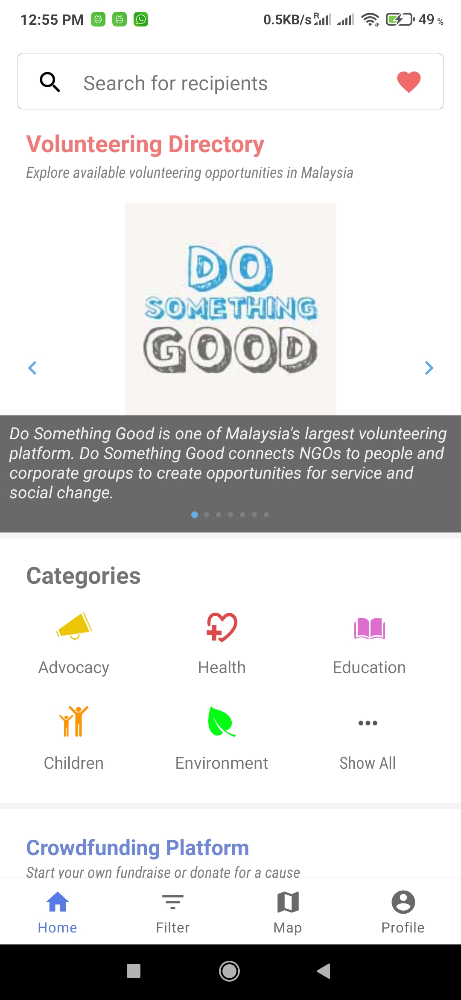 | 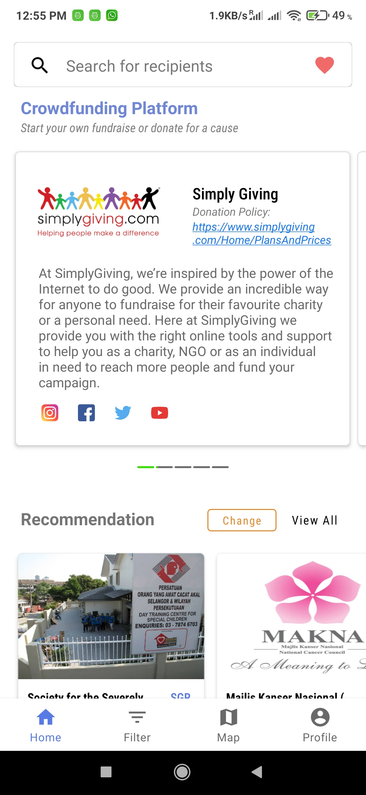 | 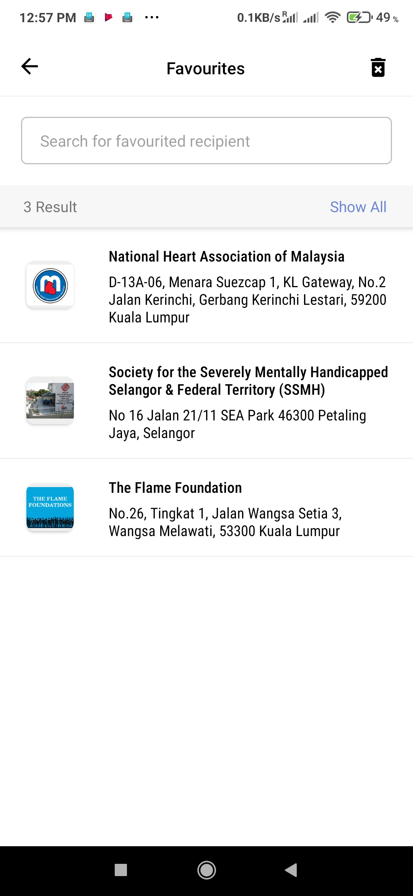

Set Location Recommendation | Set Job Nature Recommendation | Search Recipient |
:--------------------------:|:-----------------------------:|:----------------:|
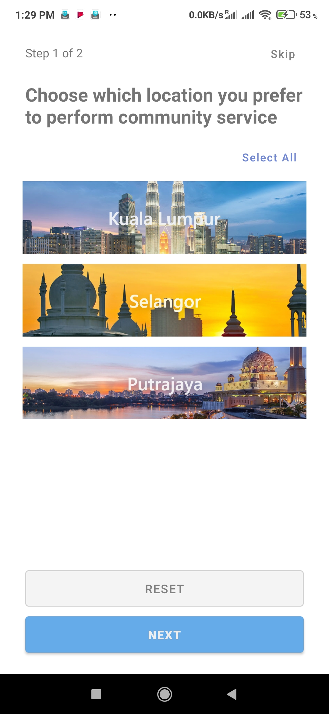 | 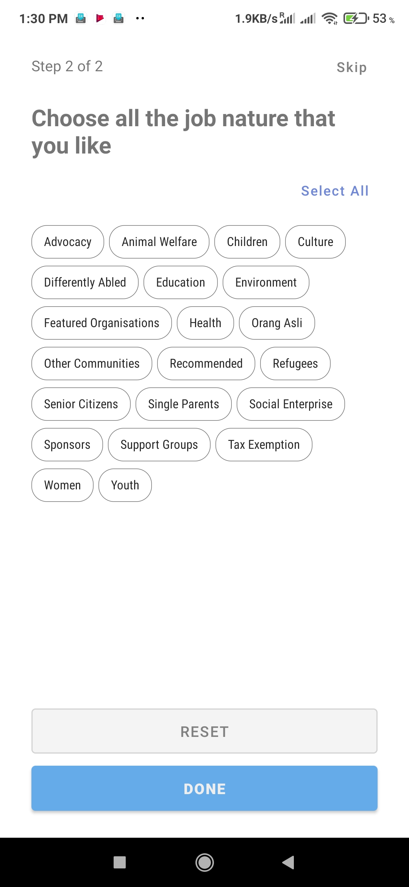 | 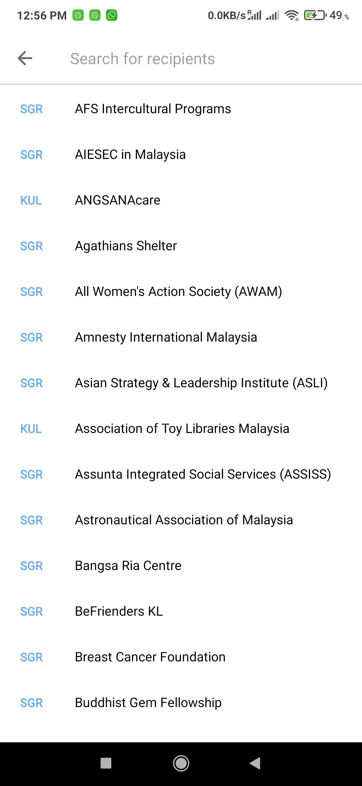

Recipient Details_1 | Recipient Details_2 | Review Recipient |
:------------------:|:-------------------:|:----------------:|
 | 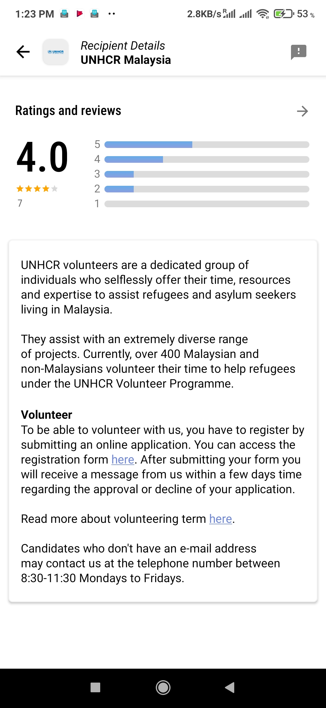 | 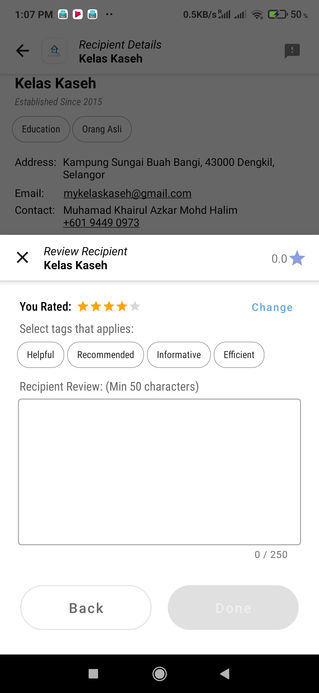

Recipient Reviews | Filter (Show All) | Filter Options
:------------------:|:-------------------:|:----------------:|
 | 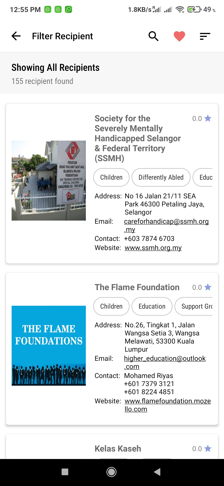 | 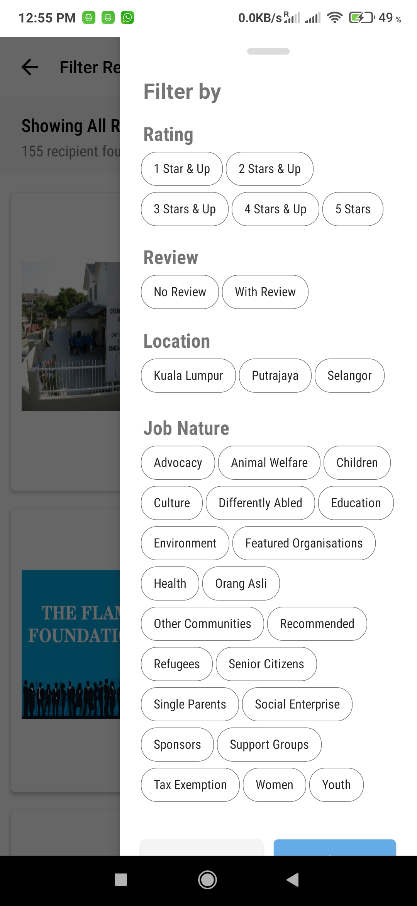

Map | Map_MarkerSelected | Sort Recipient By Distance
:------------------:|:-------------------:|:--------------
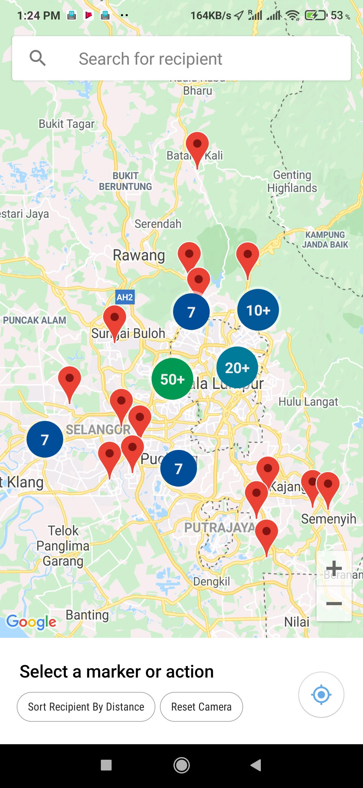 | 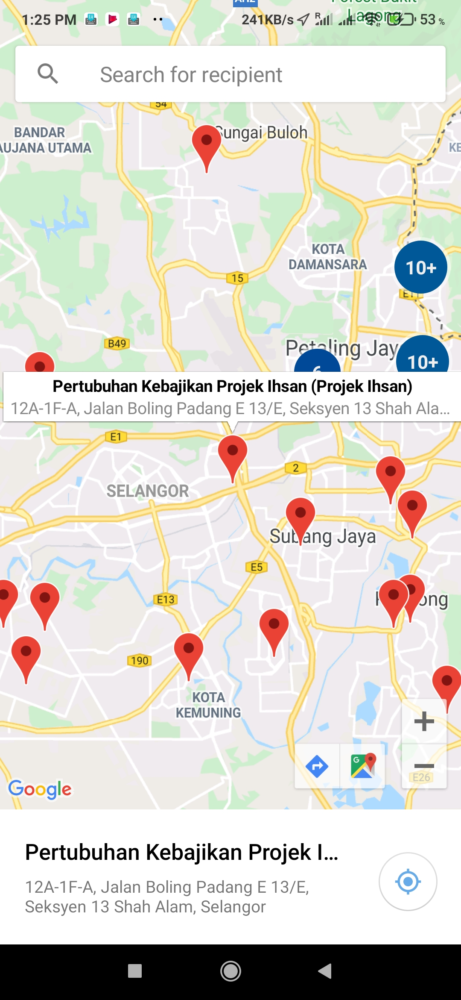 | 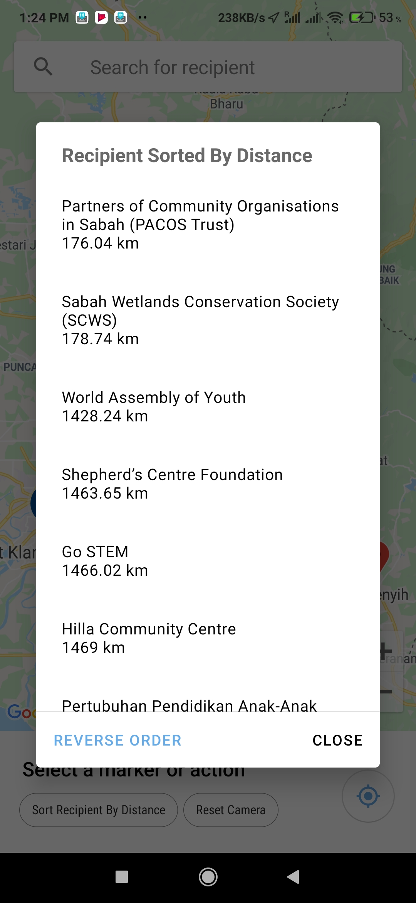

<br><br>
## Tech Stack
- Kotlin
- MVVM architecture
- [Coroutine](https://developer.android.com/kotlin/coroutines)
- [Flow (for data layer)](https://developer.android.com/kotlin/flow)
- Material Design
- [Google Maps with Fused Location Provider and Utility Library](https://developers.google.com/maps/documentation/android-sdk/overview)
- [Security Library (for sharedPreferences encryption and decryption)](https://developer.android.com/topic/security/data)
- Google AdMob
- [Leak Canary](https://square.github.io/leakcanary/#:~:text=LeakCanary%20is%20a%20memory%20leak,developers%20dramatically%20reduce%20OutOfMemoryError%20crashes.)

__Backend (Firebase)__
- [Cloud Messaging](https://firebase.google.com/docs/cloud-messaging)
- [Real-time Database](https://firebase.google.com/docs/database)
- [Firestore](https://firebase.google.com/docs/firestore)
- [Auth](https://firebase.google.com/docs/auth)
- [Cloud Functions](https://firebase.google.com/docs/functions)

__Dependency Injection (DI)__
- [Hilt](https://developer.android.com/training/dependency-injection/hilt-android)

__Image Hosting__
- [Cloudinary](https://cloudinary.com/documentation/android_integration)

__Image Loader__
- [Glide](https://github.com/bumptech/glide)

__[Android Jetpack](https://developer.android.com/jetpack)__
- [DataBinding](https://developer.android.com/topic/libraries/data-binding)
- [LiveData (for view layer)](https://developer.android.com/topic/libraries/architecture/livedata)
- [Navigation Component](https://developer.android.com/guide/navigation/navigation-getting-started)
- [Room Persistence Library (local db)](https://developer.android.com/training/data-storage/room)
- [WorkManager](https://developer.android.com/topic/libraries/architecture/workmanager)
- [Paging 3](https://developer.android.com/topic/libraries/architecture/paging/v3-overview)

__Logging__
- [Timber](https://github.com/JakeWharton/timber)

Others
- [Tooltip](https://github.com/skydoves/Balloon)
- [FloatingSearchView](https://github.com/arimorty/floatingsearchview)
- [Lottie](https://github.com/airbnb/lottie-android)
- [Loupe](https://github.com/igreenwood/loupe)

<br><br>
## Interested to Help?
This project is maintained by one person thus it is very much appreciated for any support and help given. There are a few ways you could help as follows:
<br><br>
<b>1) Report Broken or Missing Social Media Links</b><br>
Recipient may have social media that was incorrectly linked thus making it impossible to open or some social media may have been missed out. Currently, eight social media are being collected:<br>
a) Instagram<br>
b) LinkedIn<br>
c) Facebook<br>
d) Twitter<br>
e) Vimeo<br>
f) Youtube<br>
g) Flickr<br>
h) Pinterest
<br><br>
<b>2) Contribute to Recipient Data Collection / Amendment</b><br>
Recipient information may change over time due to various reasons, there is no way to prevent it but there is a need to identify how to provide the latest information. This would require a dedicated person or team to periodically perform validation check with the recipient based on the existing data collected as well as to obtain data that needs to be collected.
<br><br>
Kindly contact +601 6820 9425 or tribercs@gmail.com to learn about what data need to be collected specifically.
<br><br>
<b>3) Rate the App on Playstore</b><br>
Rating allows the app to be recommended by PlayStore to other users with similar interest thus reaching a wider audience.
<br><br>
<b>4) Share App With Friends</b><br>
If you find the app to be useful, share it with friends to spread awareness!
<br><br>
<b>5) Buy me a Coffee</b><br>
You can buy me a coffee here to continue support the cost of running the app.
<br>
https://www.buymeacoffee.com/Triber
<br><br>
<b>6) Provide Feedback or Suggesstion</b><br>
Triber continually strive to improve itself, but it cannot be done alone thus your feedback and suggestion is needed on:<br>
a) User Experience<br>
b) User Interface<br>
c) Features you would like to have<br>
d) Reporting bugs or crashes<br>
e) What can be done better? 
<br><br>
<b>7) Help in App Development</b><br>
If you are a developer (front-end or back-end) and are interested to help, kindly contact +601 6820 9425 or tribercs@gmail.com for further discussion.

Alternatively, you can submit a PR while adding your own:
- __Firebase Key__<br>
Put 'google-services.json' under project app folder
- __Google Maps Api Key__<br>
Put your maps api key in local.properties file under root folder like this
```
sdk.dir=........
MAPS_API_KEY=YOUR_KEY_HERE
```
<br><br>
## Acknowledgement
The information collected and displayed for this app are from various online sources and is free for personal usage.
